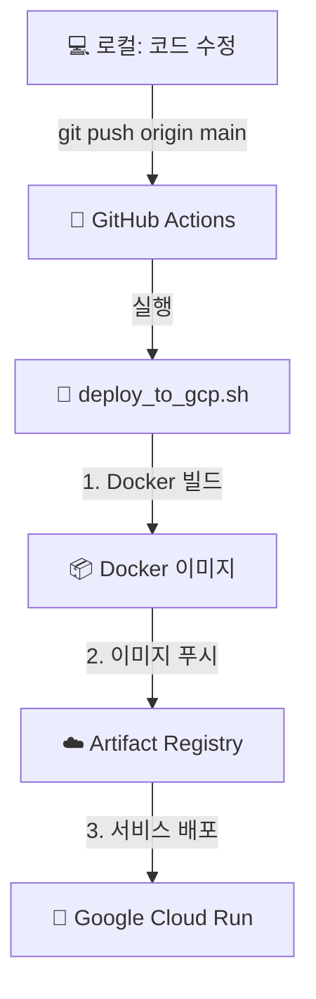

# Greenround - GitHub Actions 자동 배포 가이드 🚀

## 📋 목차
1. [자동 배포 개요](#-1-자동-배포-개요)
2. [GitHub Secrets 설정 (최초 1회)](#-2-github-secrets-설정-최초-1회)
3. [CI/CD 파이프라인 상세 분석](#-3-cicd-파이프라인-상세-분석)
4. [모니터링 및 문제 해결](#-4-모니터링-및-문제-해결)

---

## 🚀 1. 자동 배포 개요

### 동작 방식
이 프로젝트는 `main` 브랜치에 코드를 `push`하면 GitHub Actions가 자동으로 Google Cloud Run에 배포하는 CI/CD 파이프라인을 사용합니다.

### 핵심 흐름도


**핵심**: 개발자는 코드를 `push`하기만 하면, GitHub Actions가 `deploy_to_gcp.sh` 스크립트를 실행하여 모든 배포 과정을 자동으로 처리합니다.

---

## ⚙️ 2. GitHub Secrets 설정 (최초 1회)

자동 배포를 위해 GitHub 저장소에 GCP 인증 정보 및 프로젝트 설정을 안전하게 저장해야 합니다.

**📍 위치**: GitHub 저장소 → `Settings` → `Secrets and variables` → `Actions` → `New repository secret`

### 필수 Secrets 목록

| Secret 이름          | 값 (Value)                                      | 설명                                     |
|----------------------|-------------------------------------------------|------------------------------------------|
| `GCP_SA_KEY`         | `gcs-credentials.json` 파일의 **전체 내용**     | GCP 서비스 계정 인증 키 (JSON 형식)        |


---

### 🔑 `GCP_SA_KEY` Secret 설정 가이드

`GCP_SA_KEY`는 가장 중요한 보안 정보입니다.

1.  **`gcs-credentials.json` 파일 얻기**
    -   이 파일은 최초 환경 설정 시 `setup_gcp_environment.sh` 스크립트를 실행하면 프로젝트 루트에 **단 한 번 생성**됩니다.
    -   이 스크립트는 프로젝트에 필요한 모든 GCP 리소스(서비스 계정 포함)를 설정합니다.

2.  **Secret 값 복사 및 붙여넣기**
    -   `gcs-credentials.json` 파일을 열어 **`{` 부터 `}` 까지 모든 내용을 복사**합니다.
    -   GitHub `GCP_SA_KEY` Secret 값으로 붙여넣습니다.

**⚠️ 중요**: `gcs-credentials.json` 파일은 Git에 절대 커밋하면 안 됩니다. `.gitignore`에 포함되어 있는지 항상 확인하세요.

---

## 🔄 3. CI/CD 파이프라인 상세 분석

### 📜 GitHub Actions 워크플로우 (`.github/workflows/deploy.yml`)

-   **역할**: `main` 브랜치에 `push` 이벤트가 발생하면, GCP 환경을 설정하고 `deploy_to_gcp.sh` 스크립트를 실행합니다.
-   **트리거**: `on: push: branches: [ main ]`
-   **주요 단계**:
    1.  **코드 체크아웃**: 최신 코드를 가져옵니다.
    2.  **GCP 인증**: `secrets.GCP_SA_KEY`를 사용하여 GCP에 인증합니다.
    3.  **`deploy_to_gcp.sh` 실행**: 배포 스크립트에 실행 권한을 주고 실행합니다.
        ```yaml
        - name: Deploy to Google Cloud Run
          run: |
            chmod +x deploy_to_gcp.sh
            ./deploy_to_gcp.sh
        ```

### 📜 배포 스크립트 (`deploy_to_gcp.sh`)

GitHub Actions Runner 환경에서 실행되며, 실제 배포 작업을 수행합니다.

-   **역할**: Docker 이미지를 빌드하고, Artifact Registry에 푸시한 후, Cloud Run에 배포합니다.
-   **단계별 주요 명령어**:
    1.  **환경변수 로드**: `.env` 파일에서 GCP 설정값을 읽어옵니다.
    2.  **Docker 인증**: `gcloud auth configure-docker` 명령어로 Artifact Registry에 접근 권한을 설정합니다.
    3.  **이미지 빌드**: `docker build` 명령어로 `Dockerfile`을 기반으로 애플리케이션 이미지를 생성합니다.
    4.  **이미지 푸시**: `docker push` 명령어로 생성된 이미지를 Artifact Registry 저장소에 업로드합니다.
    5.  **Cloud Run 배포**: `gcloud run deploy` 명령어로 새 이미지를 사용하여 Cloud Run 서비스를 업데이트합니다. GPU, 메모리, 타임아웃 등 서비스 설정이 이 단계에서 적용됩니다.

---

## 🔍 4. 모니터링 및 문제 해결

### 로그 확인 방법
-   **GitHub Actions 로그**: 배포 실패의 **1차 원인**을 파악할 수 있습니다. (인증 실패, 빌드 오류 등)
    -   **위치**: GitHub 저장소 → `Actions` → 해당 워크플로우 실행 기록
-   **Cloud Run 로그**: 애플리케이션 실행 오류를 확인할 수 있습니다.
    -   **위치**: Google Cloud Console → `Cloud Run` → 해당 서비스 → `LOGS` 탭

### 자주 발생하는 오류
-   **`permission denied` 오류 (GitHub Actions)**: `GCP_SA_KEY`에 저장된 서비스 계정의 권한이 부족한 경우입니다. `setup_gcp_environment.sh`의 권한 설정을 확인하세요.
-   **`ModuleNotFoundError` (Cloud Run 로그)**: `requirements.txt`에 패키지가 누락되었거나, Docker 빌드 과정에서 설치가 실패한 경우입니다.
-   **`invalid authentication credentials` (GitHub Actions)**: `GCP_SA_KEY` Secret 값이 잘못되었을 가능성이 높습니다. JSON 전체가 올바르게 복사되었는지 확인하세요.

---

## 🌐 배포 후 확인사항

### API 엔드포인트 테스트
```bash
# 서비스 URL 가져오기
SERVICE_URL=$(gcloud run services describe golf-analyzer-backend --region=asia-northeast3 --format='value(status.url)')

# API 문서 확인
curl -s "$SERVICE_URL/docs"

# 헬스 체크
curl -s "$SERVICE_URL/api/health"

# 시스템 정보
curl -s "$SERVICE_URL/api/info"
```

### 주요 접속 URL
- **API 문서**: `https://서비스-URL/docs`
- **OpenAPI 스키마**: `https://서비스-URL/openapi.json`
- **헬스 체크**: `https://서비스-URL/api/health`
- **시스템 정보**: `https://서비스-URL/api/info`

---

## 📊 모니터링 및 관리

### 실시간 로그 모니터링
```bash
# 배포 스크립트로 로그 보기
./deploy_to_gcp.sh --logs

# 직접 gcloud 명령어 사용
gcloud logs tail --follow \
    --resource-labels=service_name=golf-analyzer-backend \
    --resource-labels=location=asia-northeast3
```

### 서비스 업데이트
```bash
# 새 버전 배포
./deploy_to_gcp.sh v2.0.0

# 트래픽 분할 (카나리 배포)
gcloud run services update-traffic golf-analyzer-backend \
    --region=asia-northeast3 \
    --to-revisions=REVISION-1=50,REVISION-2=50
```

### 스케일링 설정
```bash
# 최대/최소 인스턴스 수 조정
gcloud run services update golf-analyzer-backend \
    --region=asia-northeast3 \
    --max-instances=20 \
    --min-instances=1 \
    --concurrency=1000
```

### 비용 최적화
- **인스턴스 수 제한**: `--max-instances` 설정
- **CPU/메모리 최적화**: 필요에 따라 리소스 조정
- **리비전 정리**: 오래된 리비전 삭제
- **청구 알람 설정**: Google Cloud Console에서 예산 알람 설정

---

## 🛠️ 개발 워크플로우

### 로컬 개발 환경
```bash
# 로컬에서 백엔드 실행
cd backend
python -m uvicorn main:app --host 0.0.0.0 --port 8001 --reload
```

### 배포 워크플로우
1. **코드 수정** → Git 커밋
2. **로컬 테스트** → 기능 확인
3. **배포 실행** → `./deploy_to_gcp.sh`
4. **배포 확인** → API 테스트
5. **모니터링** → 로그 및 성능 확인

### 버전 관리
```bash
# Git 태그로 버전 관리
git tag v1.2.0
git push origin v1.2.0

# 특정 버전으로 배포
./deploy_to_gcp.sh v1.2.0
```

---

## 🔗 유용한 링크

- [Google Cloud Console](https://console.cloud.google.com)
- [Cloud Run 문서](https://cloud.google.com/run/docs)
- [Artifact Registry 문서](https://cloud.google.com/artifact-registry/docs)
- [Docker Buildx 문서](https://docs.docker.com/buildx/)

---

## 💡 팁 & 베스트 프랙티스

### 개발 팁
1. **로컬 개발**: GCS 인증 없이도 로컬 파일로 동작
2. **빠른 테스트**: `--deploy-only`로 빌드 시간 단축
3. **로그 확인**: 문제 발생 시 실시간 로그로 디버깅

### 보안 팁
1. **서비스 계정 키**: `gcs-credentials.json` 파일 보안 관리
2. **환경 변수**: 민감한 정보는 환경 변수로 관리
3. **권한 최소화**: 필요한 권한만 부여

### 성능 팁
1. **리소스 모니터링**: CPU/메모리 사용량 주기적 확인
2. **캐시 활용**: Docker 빌드 캐시 최적화
3. **인스턴스 관리**: 트래픽에 따른 스케일링 설정

---

**📞 지원이 필요하신가요?**
- 문제 해결: 위 문제 해결 섹션 참조
- 추가 도움: GitHub Issues 등록 